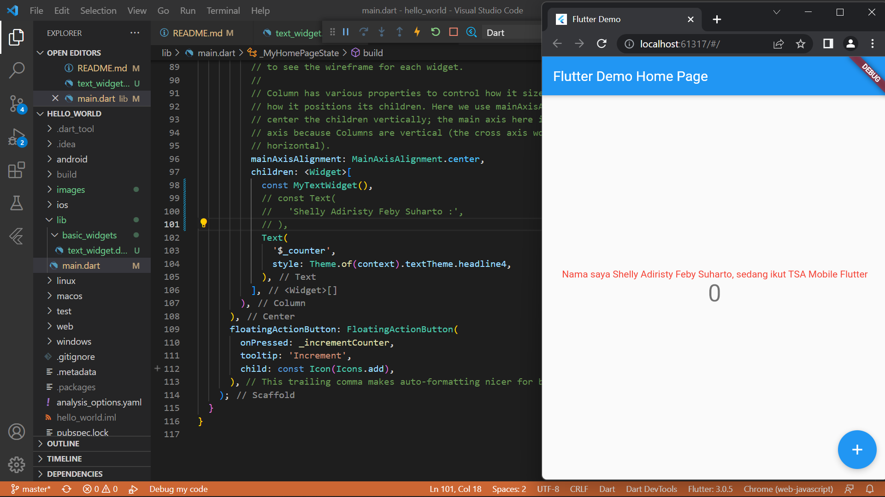
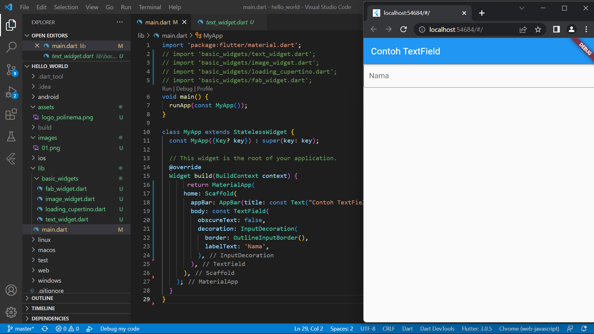

# **Tugas Pertemuan 16**
## **Project hello_world**

### Praktikum 1 : Membuat Project Flutter Baru

### Praktikum 2 : Membuat Repository GitHub dan Laporan Praktikum 
* Langkah 1 Login ke akun GitHub Anda, lalu buat repository baru dengan nama "flutter-fundamental-part1"

* Langkah 2 Lalu klik tombol "Create repository" lalu akan tampil seperti gambar berikut.

* Langkah 3 Kembali ke VS code, project flutter hello_world, buka terminal pada menu Terminal > New Terminal. Lalu ketik perintah berikut untuk inisialisasi git pada project Anda.

* Langkah 4 – 9 Setelah berhasil melakukan push, masukkan username GitHub Anda dan password berupa token yang telah dibuat (pengganti password konvensional ketika Anda login di browser GitHub). Reload halaman repository GitHub Anda, maka akan tampil hasil push kedua file tersebut seperti gambar berikut.

* Langkah 10 Lakukan push juga untuk semua file lainnya dengan pilih Stage All Changes. Beri pesan commit "project hello_world". Maka akan tampil di repository GitHub Anda seperti berikut.

* Langkah 11 Kembali ke VS Code, ubah platform di pojok kanan bawah ke emulator atau device atau bisa juga menggunakan browser Chrome. Lalu coba running project hello_world dengan tekan F5 atau Run > Start Debugging. Tunggu proses kompilasi hingga selesai, maka aplikasi flutter pertama Anda akan tampil seperti berikut.

* Langkah 12 Silakan screenshot seperti pada Langkah 11, namun teks yang ditampilkan dalam aplikasi berupa nama lengkap Anda. Simpan file screenshot dengan nama 01.png pada folder images (buat folder baru jika belum ada) di project hello_world Anda. Lalu ubah isi README.md seperti berikut, sehingga tampil hasil screenshot pada file README.md. Kemudian push ke repository Anda.

### Praktikum 3 : Menerapkan Widget Dasar
* Langkah 1 Text Widget

* Langkah 2 Image Widget

### Praktikum 4 : Menerapkan Widget Material Design dan iOS Cupertino
* Langkah 1: Cupertino Button dan Loading Bar

* Langkah 2: Floating Action Button (FAB)

* Langkah 3: Scaffold Widget

* Langkah 4: Dialog Widget

* Langkah 5: Input dan Selection Widget

* Langkah 6: Date and Time Pickers

### **Tugas 2** : Pada praktikum 4 mulai dari Langkah 3 sampai 6, buatlah file widget tersendiri di folder basic_widgets, kemudian pada file main.dart cukup melakukan import widget sesuai masing-masing langkah tersebut!

